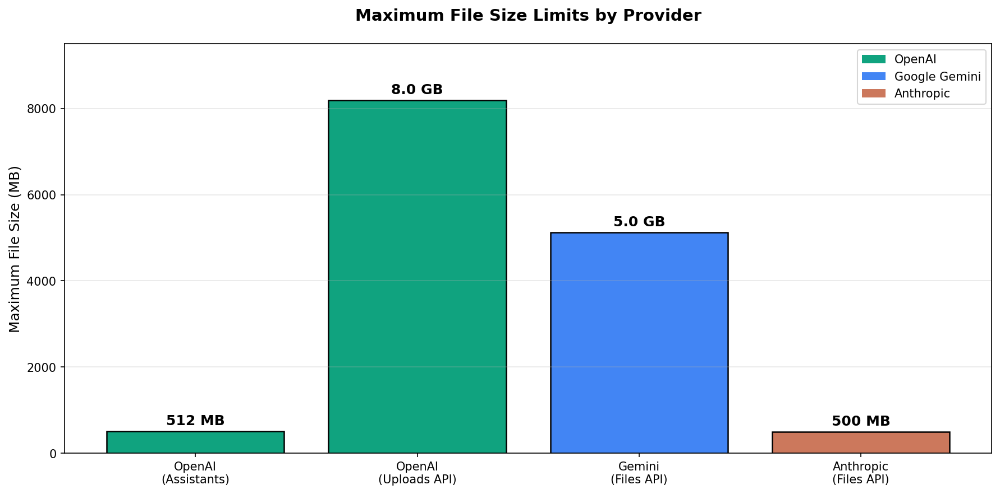
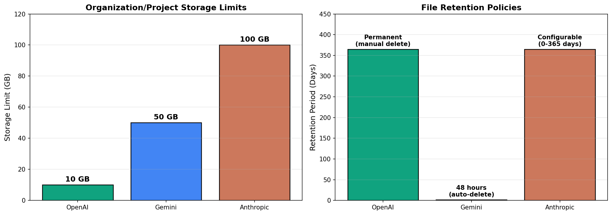
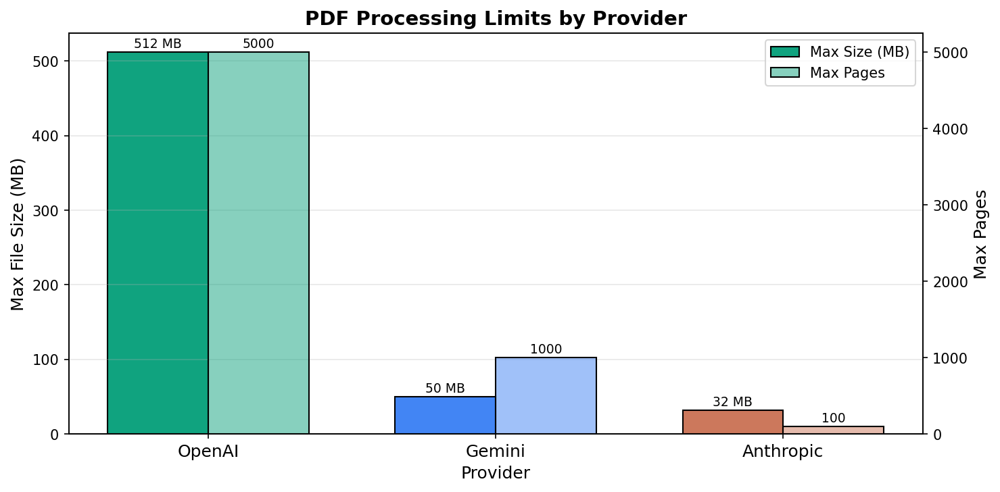
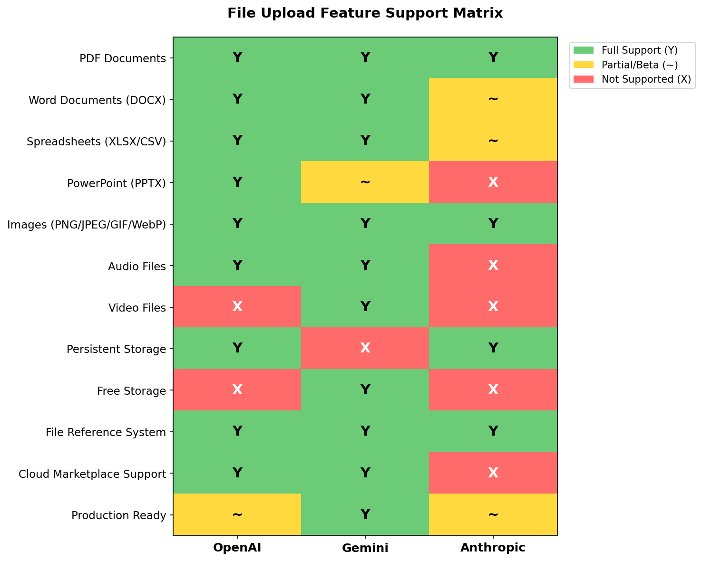

# File Upload and Retrieval APIs: Research Report
## Comparing OpenAI, Google Gemini, and Anthropic Approaches

---

## Executive Summary

The three leading AI API providers—OpenAI, Google Gemini, and Anthropic—have taken fundamentally different approaches to file upload and retrieval, reflecting their distinct strategic priorities and target use cases.

**OpenAI** offers the most mature file handling ecosystem with purpose-driven architecture, supporting files up to 8GB through its Uploads API and providing permanent storage until manual deletion. However, its Assistants API—a key component of file-based workflows—is deprecated and will shut down in August 2026 [1].

**Google Gemini** provides the most comprehensive multimodal support, handling documents, images, audio, and video natively. Its Files API offers generous limits (up to 5GB per file, 50GB per project) and free storage. The critical limitation is a mandatory 48-hour retention period—files are automatically deleted and cannot be persisted longer [2].

**Anthropic** takes a developer-friendly approach with its beta Files API, offering the largest organization-level storage (100GB) and uniquely configurable retention periods from 0-365 days. The main constraints are its beta status and unavailability on cloud marketplaces like Amazon Bedrock and Google Vertex AI [3].

For developers choosing between platforms, the decision hinges primarily on three factors: retention requirements (Gemini's 48-hour limit is disqualifying for many RAG applications), multimodal needs (only Gemini supports audio/video natively), and cloud deployment preferences (Anthropic's Files API requires direct API access).

---

## Methodology & Limitations

This research draws primarily from official API documentation for all three providers [1][2][3], supplemented by developer community discussions [4][5], third-party technical analyses [6][7], and Microsoft's Azure OpenAI documentation [8] for additional context on enterprise deployments.

**Limitations include:**

- Official documentation pages (platform.openai.com, ai.google.dev, docs.anthropic.com) returned 403 errors during direct fetching, requiring reliance on search result summaries and cached information
- Anthropic's Files API is in beta, meaning specifications may change before general availability
- Pricing information for file storage and processing was not comprehensively available across all providers
- Community reports suggest documentation doesn't always match actual API behavior, particularly for OpenAI's supported file formats [4]
- Enterprise-specific features and limits may differ from standard API offerings

---

## Findings

### The Architecture Divide: Three Philosophies of File Handling

Each provider has designed their file handling around a distinct philosophy that shapes the developer experience and use case fit.

OpenAI structures its Files API around explicit purposes: when uploading a file, developers must declare whether it's for assistants, fine-tuning, batch processing, vision, or general user data [1]. This purpose-driven approach provides clarity but creates rigidity—a file uploaded for one purpose cannot be repurposed without re-uploading. The system supports a wide range of document formats including PDF, DOCX, PPTX, XLSX, CSV, and JSON for the Assistants API, while fine-tuning accepts only JSONL files [9].

Google Gemini takes a multimodal-native approach with a unified Files API that handles all media types through a single interface [2]. Developers can upload documents, images, audio (MP3, M4A, WAV), and video files using the same `media.upload` endpoint. For smaller files under 20MB, Gemini also supports inline uploads where content is base64-encoded directly in the request body. This flexibility makes Gemini particularly well-suited for applications that process diverse media types.

Anthropic emphasizes simplicity with a "create once, use many times" pattern [3]. Files are uploaded to receive a `file_id`, which can then be referenced in document content blocks across multiple API calls. This approach reduces bandwidth for repeated document analysis and supports a clean separation between file management and conversation handling.

### Storage and Retention: The Critical Differentiator

The starkest difference between providers lies in how long files persist after upload—a factor that can fundamentally shape application architecture.

OpenAI provides permanent storage by default. Files remain available until explicitly deleted through the API, with one exception: batch files automatically expire after 30 days [1]. This permanence makes OpenAI suitable for building persistent document stores, knowledge bases, and retrieval-augmented generation (RAG) applications where files need to be referenced over extended periods.

Gemini's 48-hour automatic deletion policy represents a fundamentally different design choice [2][10]. Files uploaded through the Files API are stored for exactly 48 hours before automatic purging, with no option to extend retention. This limitation has generated significant developer frustration, with community members reporting the need to implement workarounds like cron jobs that re-upload files every 24 hours [10]. The Google AI Developers Forum includes feature requests for configurable TTL (time-to-live) settings, but as of January 2025, this remains unavailable [11].

Anthropic offers the most flexible retention model, allowing enterprise and tenant accounts to configure retention anywhere from 0 to 365 days [3]. This configurability makes Anthropic's approach adaptable to various compliance requirements and use cases, from ephemeral processing to long-term document storage.

### Document Processing Capabilities

All three providers have invested heavily in document understanding, particularly for PDFs, but their technical approaches differ.

OpenAI processes documents through text extraction and embedding generation, supporting PDF files up to 512MB within the Assistants API context [1]. Documents are parsed into text segments that can be searched and retrieved using the file search tool. The platform supports a maximum of 5 million tokens per file, computed automatically during upload [9].

Gemini uses native vision capabilities to understand PDF documents, treating each page as an image [12]. This vision-based approach enables understanding of layouts, charts, diagrams, and tables beyond pure text extraction. PDFs can be up to 50MB or 1,000 pages, with each page consuming approximately 258 tokens [12]. The system can extract information into structured formats, transcribe document content while preserving layouts, and answer questions based on both visual and textual elements.

Anthropic similarly converts PDF pages to images for processing, enabling visual understanding of document structure [13]. The limits are more restrictive: 32MB maximum file size and 100 pages per document. For Word documents containing images, Anthropic recommends converting to PDF first to take advantage of the built-in image parsing capabilities.

### Image and Multimedia Support

Image support is consistent across all three providers, with universal acceptance of PNG, JPEG, GIF, and WebP formats. The limits and best practices vary, however.

OpenAI's vision capabilities support images up to 20MB when uploaded with the vision purpose [1]. Images can be included in chat completions for visual analysis and understanding.

Gemini handles images as part of its broader multimodal framework, supporting both inline (base64) and file upload methods [2]. Beyond images, Gemini uniquely supports audio files (MP3, M4A, WAV with approximately 10-minute limits for standard tiers, 3 hours for Pro/Ultra) and video files (up to 2GB per video, 5 minutes standard or 1 hour for Pro/Ultra) [6].

Anthropic's vision capabilities impose specific size constraints: single images cannot exceed 8,000 × 8,000 pixels, and when more than 20 images are included in a single request, a stricter 2,000 × 2,000 pixel limit applies [14]. For optimal performance, Anthropic recommends resizing images to no more than 1.15 megapixels with maximum dimensions of 1,568 pixels. Image token costs are calculated as (width × height) / 750.

### Platform Availability and Enterprise Considerations

For organizations deploying through cloud marketplaces, platform availability becomes a critical consideration.

OpenAI's file handling capabilities are available through both the direct API and Azure OpenAI Service, though Azure has more restricted format support—notably excluding XLSX files even though the native OpenAI API accepts them [8].

Gemini's Files API integrates with Google Cloud Platform and is accessible through Vertex AI. Enterprise users can select regional storage (US, EU, or APAC) for compliance requirements [6].

Anthropic's Files API is currently not supported on Amazon Bedrock or Google Vertex AI [3]. Organizations requiring cloud marketplace deployment must use the direct Anthropic API, which may have implications for procurement, billing, and enterprise governance.

### The Deprecation Question: OpenAI's Assistants API

A significant consideration for OpenAI users is the deprecation of the Assistants API, announced to shut down on August 26, 2026 [9]. The Assistants API has been the primary interface for file search and document-based workflows, and its replacement—the Responses API—may handle files differently. Organizations building on OpenAI's file capabilities should factor migration planning into their technical decisions.

---

## Areas of Uncertainty

Several aspects of file handling across these platforms remain unclear or disputed:

**Actual versus documented format support**: Community reports indicate that OpenAI's documented supported formats don't always work in practice. Multiple developers have reported CSV uploads failing despite CSV being listed as supported, with error messages indicating "Expected file type to be a supported format: .pdf but got .csv" [4]. The root cause appears to be that supported formats vary by endpoint and purpose, but documentation doesn't always make these distinctions clear.

**Anthropic's beta status implications**: The Files API requires a beta header (`anthropic-beta: files-api-2025-04-14`), signaling that the API may change before general availability [3]. Organizations building production systems should consider the possibility of breaking changes.

**Gemini retention workarounds**: While developers have implemented 48-hour retention workarounds, the reliability and scalability of these approaches (particularly for large file volumes) remains unvalidated at scale [10].

**Token counting variations**: How each provider counts tokens for document processing differs, making direct cost comparisons difficult. Gemini counts PDF pages under the IMAGE modality [12], while Anthropic uses a pixel-based formula for images [14]. These differences affect cost estimation for document-heavy workloads.

**Enterprise tier differences**: Premium and enterprise tiers likely offer different limits and capabilities than standard API access, but comprehensive documentation of these differences is not publicly available.

---

## Conclusion

The choice between OpenAI, Google Gemini, and Anthropic for file-based AI applications depends heavily on specific use case requirements:

**Choose OpenAI if** you need permanent document storage, are building RAG or knowledge base applications, and can accommodate migration from the Assistants API before August 2026. OpenAI offers the most mature ecosystem and widest format support for document workflows.

**Choose Gemini if** you're processing diverse media types (audio, video, documents), want free storage to minimize costs, can work within 48-hour file lifecycles, or need the largest context window (1M tokens) for processing lengthy content.

**Choose Anthropic if** you need flexible retention policies, prefer a simple upload-once-reference-many pattern, require the largest organization storage quota (100GB), and can use the direct API without cloud marketplace intermediaries.

No single provider dominates all dimensions. The most significant trade-offs involve retention (Gemini's 48-hour limit vs. permanent/configurable), multimodal breadth (only Gemini handles audio/video), and platform availability (Anthropic's Files API is direct-only). Organizations should prototype with their actual file types and volumes before committing to a provider, and should build abstraction layers that could accommodate future provider changes.

---

## Sources

[1] OpenAI. "Files API Reference." OpenAI Platform Documentation, 2025. https://platform.openai.com/docs/api-reference/files (HIGH)

[2] Google. "Files API | Gemini API." Google AI for Developers, 2025. https://ai.google.dev/gemini-api/docs/files (HIGH)

[3] Anthropic. "Files API." Claude Documentation, 2025. https://docs.anthropic.com/en/docs/build-with-claude/files (HIGH)

[4] OpenAI Community. "What file types are *actually* supported?" OpenAI Developer Forum, 2024. https://community.openai.com/t/what-file-types-are-actually-supported/929529 (MEDIUM)

[5] OpenAI Community. "AI assistants file limits." OpenAI Developer Forum, 2024. https://community.openai.com/t/ai-assistants-file-limits/566434 (MEDIUM)

[6] DataStudios. "Google Gemini File Upload and Reading: supported formats, limits, and enterprise use." DataStudios.org, 2025. https://www.datastudios.org/post/google-gemini-file-upload-and-reading-supported-formats-limits-and-enterprise-use (MEDIUM)

[7] DataStudios. "How to use Claude with the Anthropic API for document analysis." DataStudios.org, 2025. https://www.datastudios.org/post/how-to-use-claude-with-the-anthropic-api-for-document-analysis-tool-use-and-data-workflows-full-g (MEDIUM)

[8] Microsoft. "How to use Azure OpenAI Assistants file search." Microsoft Learn, 2025. https://learn.microsoft.com/en-us/azure/ai-foundry/openai/how-to/file-search (HIGH)

[9] OpenAI. "Assistants File Search - Supported Files." OpenAI Platform Documentation, 2025. https://platform.openai.com/docs/assistants/tools/file-search/supported-files (HIGH)

[10] Google AI Developers Forum. "What Happens to My Uploaded Files When Using Google API with Gemini 2.0 Flash?" Google AI Forum, 2024. https://discuss.ai.google.dev/t/what-happens-to-my-uploaded-files-when-using-google-api-with-gemini-2-0-flash-storage-limits-and-default-behavior-explained/74763 (MEDIUM)

[11] GitHub. "Files API should accept TTL shorter than 48 hours." googleapis/python-genai Issues, 2024. https://github.com/googleapis/python-genai/issues/1172 (MEDIUM)

[12] Google. "Document understanding | Gemini API." Google AI for Developers, 2025. https://ai.google.dev/gemini-api/docs/document-processing (HIGH)

[13] Anthropic. "PDF support." Claude Documentation, 2025. https://docs.anthropic.com/en/docs/build-with-claude/pdf-support (HIGH)

[14] Anthropic. "Vision." Claude Documentation, 2025. https://docs.anthropic.com/en/docs/build-with-claude/vision (HIGH)

---

*Report generated: January 10, 2025*
